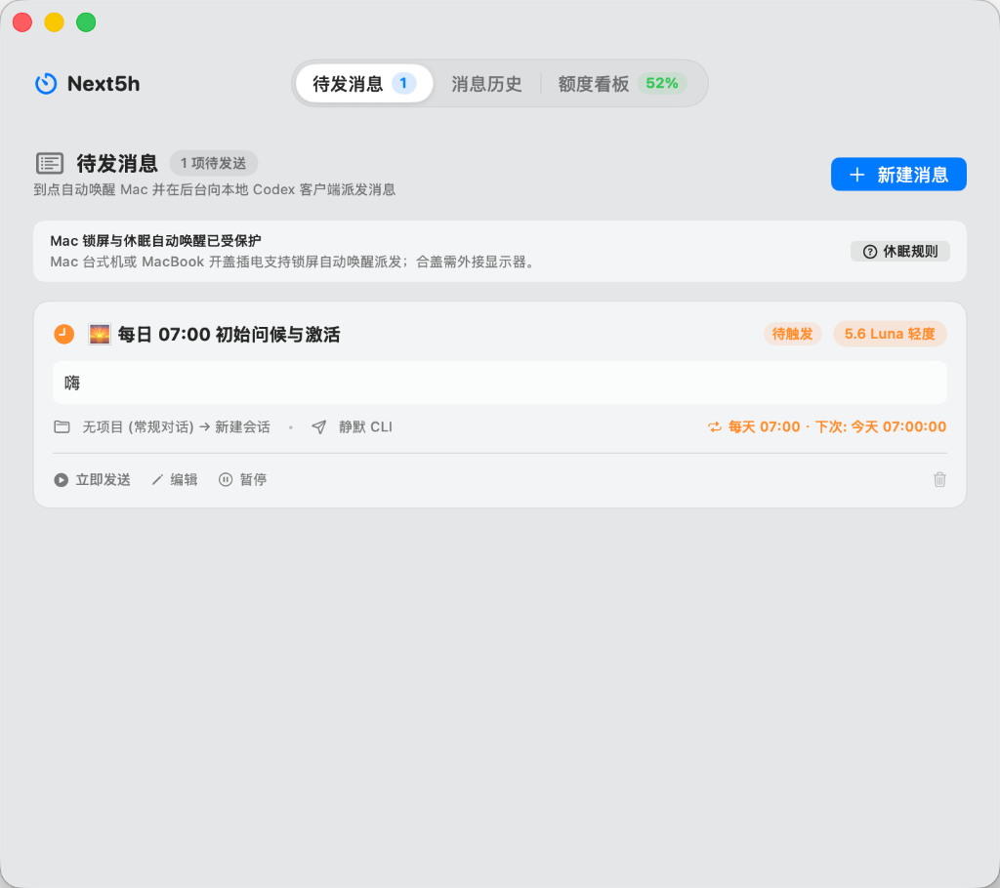

# Next5h - macOS 原生 Codex 5H 自动续航工作台

<p align="center">
  
  
  
  
  
</p>

> 为 macOS 开发者量身打造的 **Codex 5H 窗口自动续航与任务排定工具**。在 5H 额度解封或每天指定时间，自动唤醒 Mac 并向本地 Codex 客户端静默/前台派发任务，绝不浪费任何 5H 宝贵算力。

---

## ✨ 核心特性与技术亮点

1. 🚀 **真实本地 Codex CLI 原生链路**
   * 底层直接调用官方 `/Applications/ChatGPT.app/Contents/Resources/codex` CLI 执行，**无任何第三方中转或 Hook 注入**；
   * 完美支持**新建独立项目会话** (`codex exec`) 与**追加到已有历史会话** (`codex queue`)；
   * 通过 `codex://threads/<ID>` 深度链接协议，实现运行中的官方 Codex 桌面窗口**免重启即时刷新**。

2. ⏰ **硬件级 RTC 芯片智能唤醒 (`PowerGuardian`)**
   * 基于 macOS `IOPMSchedulePowerEvent` 内核接口，在预定时间（如每日 07:00）**提前 60 秒由主板硬件级叫醒 Mac**；
   * 自动申请 `kIOPMAssertionTypePreventUserIdleSystemSleep` 阻止系统休眠，配合 `NetworkMonitor` 握手 Wi-Fi 确保静默派发。

3. 🧭 **动态模型目录与推理强度自适应 (`ModelCatalogService`)**
   * 抛弃写死 Enum，通过 macOS `DispatchSourceFileSystemObject` 实时监听 `~/.codex/models_cache.json`；
   * 自动自适应官方模型的上线、下架、推理强度等级（`轻度` / `中` / `高` / `极高` / `Max` / `Ultra`）与调速能力；
   * 若排定任务包含已下架模型，自动平滑迁移至当前最新官方旗舰，杜绝崩溃。

4. 📊 **双周期额度监控看板 (5H + 周限额)**
   * 100% 对齐官方“剩余”逻辑，实时呈现 **5H 剩余可用量** 与 **7 天周额度剩余**；
   * 精确计算额度重置时间点与剩余倒计时展示。

5. 🪶 **28pt 极窄微胶囊状态栏与后台常驻 (`StatusItemRenderer`)**
   * 状态栏仅占用 **28pt** 单图标宽度，上下双层微胶囊实时显示 5H 与周额度剩余；
   * 关闭工作台主窗口后，自动隐藏 Dock 栏图标并常驻顶部菜单栏；点击菜单一键重新呼出面板。

6. 👑 **ChatGPT Plus / Pro 双模式智能适配**
   * **Plus 模式**：聚焦 5H 滑动周期额度救火与解封后自动续航派发；
   * **Pro 模式**：自适应切换为「PRO 尊享全速通道」，聚焦周深度推理算力池追踪与夜间批量流水线调度。

---

## 🖥️ Mac 锁屏与休眠状态下的派发支持矩阵

| 硬件形态 | 电脑当前状态 | 供电状态 | 能否在预定时间自动发送？ | 技术原理与说明 |
| :--- | :--- | :--- | :---: | :--- |
| **Mac mini / Studio / Pro**<br>*(桌面台式机)* | **锁屏 (Lock Screen)** / 显示器关闭 | 始终插电 | 🟢 **100% 完美发送** | 系统内核完全常驻，静默 CLI 模式无需屏幕解锁与前台焦点。 |
| **Mac mini / Studio / Pro**<br>*(桌面台式机)* | **系统深度休眠 (Sleep)** | 始终插电 | 🟢 **自动唤醒并发送** | 到点前 60s RTC 硬件叫醒 Mac，Wi-Fi 握手后静默执行。 |
| **MacBook (Air / Pro)**<br>*(笔记本)* | **开盖 + 锁屏 / 休眠** | **连接电源 (推荐)** | 🟢 **100% 稳定发送** | RTC 正常硬件唤醒，AC 供电下网络即时恢复并派发。 |
| **MacBook (Air / Pro)**<br>*(笔记本)* | **开盖 + 锁屏 / 休眠** | **纯电池供电** | 🟡 **支持 (受电量限制)** | 虽支持 RTC 唤醒，但低电量或省电模式可能延迟网络握手，**建议插电**。 |
| **MacBook (Air / Pro)**<br>*(笔记本)* | **合盖 + 接外接显示器**<br>*(Clamshell 合盖模式)* | **连接电源** | 🟢 **100% 稳定发送** | macOS 官方合盖台式机模式，插电即可全速常驻运行。 |
| **MacBook (Air / Pro)**<br>*(笔记本)* | **纯合盖 (Lid Closed)**<br>*(无外接显示器，放桌上/包里)* | 无论是否插电 | 🔴 **无法保证 (系统限制)** | **macOS 固件安全限制**：Apple Silicon 在纯合盖时为防过热，会彻底切断 Wi-Fi 并强制深睡。 |

> 💡 **模式建议**：使用默认的 **「后台静默 CLI 模式」**，锁屏状态下无需输入密码即可发送；前台 GUI 模式因 macOS 锁屏会拦截辅助功能按键模拟，需屏幕保持解锁。

---

## 🎯 典型使用场景

* 🌅 **每日 07:00 晨间定时激活**：
  每天早上 07:00 准时硬件唤醒 Mac，后台向 Codex 发送第一条问候或当日初始化任务，自动开启当天的 5H 额度刷新周期，让你上班时额度已充能完毕。
* ⚡ **5H 额度解封自动断点续跑**：
  编程过程中额度耗尽？排定下一步重构或测试任务并选择「5H 解封后发送」。Next5h 实时监听官方额度，一旦重置解封立即自动触发执行，算力永不闲置。
* 🌙 **深夜离线批量无人值守流水线**：
  睡前将耗时较长或多模块的重构任务排定在凌晨，Mac 自动唤醒并在后台静默调用官方 CLI 执行，早晨开盖即可检视执行结果与 Git Diff。

<p align="center">
  
</p>

---

## 📁 目录与架构结构

```
next5h/
├── Package.swift               # Swift Package 配置
├── build_app.sh                # 原生 App 编译与打包脚本
├── Next5h.app                  # 编译生成的 macOS 原生独立应用程序
├── assets/                     # 仓库与应用图资
│   └── screenshot.png          # 原生运行界面真实截图
├── NEXT5H_PROJECT_PLAN.md      # 项目设计方案与架构规划
├── PRO_USER_ADAPTATION_SPEC.md # ChatGPT Pro 用户全场景适配规范
├── WALKTHROUGH.md              # 完整迭代交付与验收报告
├── README.md                   # 本技术文档
├── Sources/Next5h/
│   ├── App/                    # 应用入口、状态管理与 28pt 状态栏渲染器
│   ├── Core/                   # 动态模型目录、调度引擎、探针与会话路由
│   ├── Models/                 # 数据模型 (ScheduledJob, DynamicCodexModel, QuotaSnapshot 等)
│   ├── Platform/               # 本地 Codex 上下文读取、CLI 静默派发、RTC 电源守护与通知
│   └── Views/                  # 原生 SwiftUI 界面 (工作台、队列、仪表盘、状态指示器)
└── Tests/Next5hTests/          # 自动化单元测试套件
```

---

## 🛠️ 编译与运行

### 1. 系统要求
* macOS 14.0 (Sonoma) 或更高版本
* 已安装官方 ChatGPT.app (包含 `/Applications/ChatGPT.app/Contents/Resources/codex` CLI)
* Swift 5.9+ / Xcode Command Line Tools

### 2. 构建与运行命令

```bash
# 1. 运行自动化单元测试
swift test

# 2. 一键打包生成原生 Next5h.app
./build_app.sh

# 3. 启动应用程序
open Next5h.app
```

---

## 📄 开源许可证

本项目基于 [MIT License](LICENSE) 开源发布。
