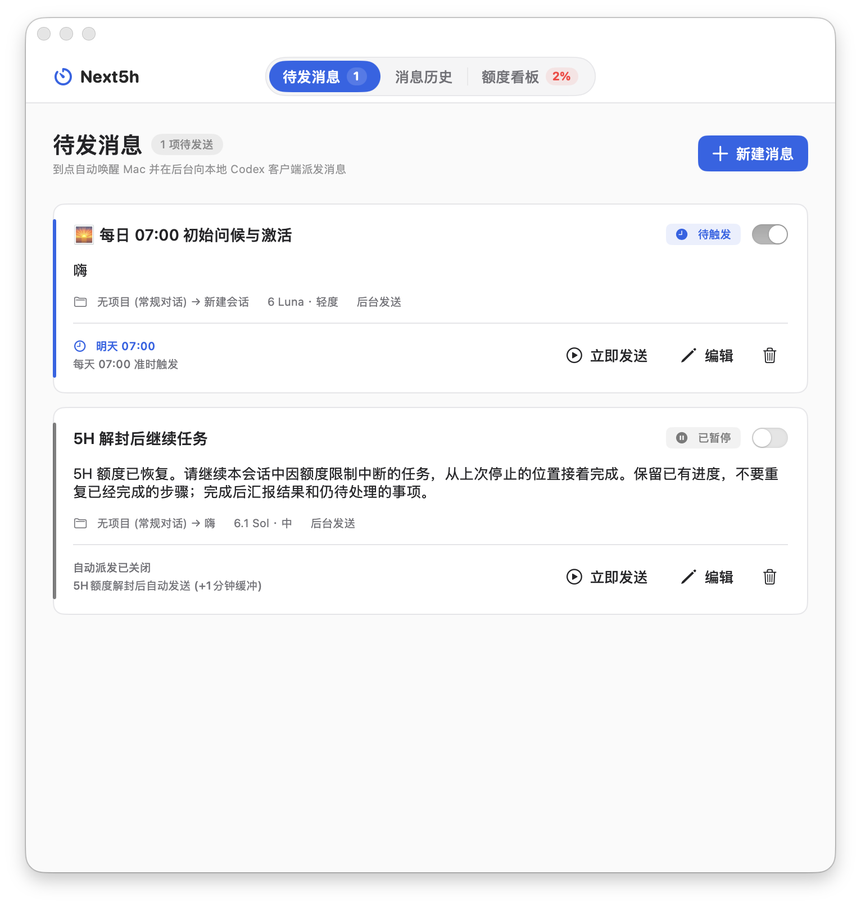

# Next5h

Native macOS scheduling for Codex: queue prompts, continue a conversation after a 5H quota reset, and track remaining usage from one workspace.

[Website](https://khalilhsu.github.io/next5h/) · [Download](https://github.com/KhalilHsu/next5h/releases/latest) · [简体中文](#简体中文)


## English

### What you can do

- **Schedule prompts four ways:** daily at a chosen time, after a 5H quota reset, after a delay, or at a specific date and time. Quick templates populate the matching trigger settings; a template created from history retains its saved strategy.
- **Choose the destination:** start a new conversation or append to an existing one, with or without a local project. Background delivery invokes the local official Codex CLI; foreground delivery opens the desktop client and uses UI automation.
- **Turn individual schedules on or off:** the switch on each queue card pauses automatic delivery without losing the prompt, destination, or model settings. Turning it back on recalculates its schedule. Manual delivery remains available for a valid destination.
- **Configure models and reasoning:** the model list follows the local Codex model cache, including available reasoning effort and speed options. If a stored model is no longer available, the app resolves a supported replacement.
- **Review delivery history:** filter successful and failed deliveries, inspect duration and parameters, copy a prompt, resend it, create a new schedule from it, or delete an individual record.
- **Monitor usage:** view 5H and weekly remaining percentages, reset times, countdowns, and probe logs. Refresh frequency adapts to local session activity. Usage is also visible in the menu bar; closing the main window keeps the app running there.

### Starter schedules

| Starter | Defaults | Automatic delivery |
| --- | --- | --- |
| Morning greeting | Daily **07:00** in the Mac's local time zone; prompt `嗨`; **6 Luna (`gpt-6-luna`), low reasoning, standard speed**; new conversation without a project; background delivery | Enabled |
| Continue task after 5H reset | Continue the interrupted task in a selected existing conversation; **current catalog default model, medium reasoning**; background delivery; **reset + 1 minute** | **Disabled** until you choose a conversation and enable it |

Existing schedules keep their saved settings when the app is updated. The disabled continuation starter is added once; deleting it does not recreate it on the next launch. New morning presets use 6 Luna / low when that model is available in the local catalog.

Use the morning schedule for a daily check-in, the continuation starter to resume work after a quota reset, or a delayed schedule for an unattended task. Next5h schedules requests; it does not increase your subscription quota or control the provider's reset policy.

### Current interface

<p align="center">
  
</p>

Screenshot supplied on October 9, 2026. It shows saved local settings; the continuation conversation must be selected on a fresh installation.

### Lock screen and sleep

Background CLI delivery can run with the display off or locked while the system is awake, with working network access and local authentication. Foreground UI delivery requires an unlocked screen and the relevant macOS automation/accessibility permissions.

For enabled tasks with a scheduled execution time, `PowerGuardian` requests an idle-sleep prevention assertion. The display can still turn off. It also attempts to register a wake event 60 seconds before execution. Wake registration can fail because of system permissions; an idle-sleep assertion does not guarantee recovery from forced sleep or a closed lid. Keep Next5h running and use an awake, connected Mac for unattended delivery. The quota tab includes the power support guide and status.

### Install or build

Download the latest DMG from [GitHub Releases](https://github.com/KhalilHsu/next5h/releases/latest), then drag **Next5h** into **Applications**. Published DMGs use Developer ID signing and Apple notarization. The screenshot and this README describe the latest source on `main`; a published release may lag behind it. Build from source to use the latest changes.

Requirements: macOS 14+, Swift 5.9+ / Xcode Command Line Tools for builds, a compatible official Codex CLI and its local login. The app searches the bundled CLI in `ChatGPT.app`, standard installation locations, and `PATH`. Quota monitoring reads local `~/.codex/auth.json`; keep that file private. Foreground delivery requires the desktop client.

```bash
git clone https://github.com/KhalilHsu/next5h.git
cd next5h
swift test
SKIP_INSTALL=1 bash build_app.sh
codesign --force --deep --sign - Next5h.app
codesign --verify --deep --strict Next5h.app
open Next5h.app

# Optional: install this local build into Applications.
ditto Next5h.app /Applications/Next5h.app
```

A local build uses an ad hoc signature. Maintainers create signed, notarized Universal DMGs and SHA-256 files with `scripts/release.sh`.

### Code map

| Path | Responsibility |
| --- | --- |
| `Sources/Next5h/App/` | App lifecycle, navigation, menu bar rendering |
| `Sources/Next5h/Core/` | Queue scheduling, model catalog, quota probes, history and session routing |
| `Sources/Next5h/Models/` | Jobs, destinations, strategies, quota snapshots and history records |
| `Sources/Next5h/Platform/` | Local context, CLI/UI delivery, networking, power management and notifications |
| `Sources/Next5h/Views/` | Queue, history, editor, quota dashboard and shared controls |
| `Tests/Next5hTests/` | Automated checks |
| `build_app.sh`, `scripts/release.sh` | Local packaging and signed release packaging |
| `WALKTHROUGH.md` | Current implementation and validation notes |

The planning documents `NEXT5H_PROJECT_PLAN.md` and `PRO_USER_ADAPTATION_SPEC.md` describe design proposals; they are not a list of shipped features.

---

## 简体中文

**Next5h 是 macOS 原生 Codex 消息排定工具。** 你可以提前写好 Prompt、在 5H 额度重置后继续已有会话，并在同一个工作台查看剩余额度与派发记录。

[官网](https://khalilhsu.github.io/next5h/) · [下载安装](https://github.com/KhalilHsu/next5h/releases/latest)

### 已支持的功能

- **四种触发策略：** 每日定时、5H 解封后、延时、指定日期时间。快捷模板会同步对应的触发设置；从历史记录新建模板会保留已保存的策略。
- **选择发送目标：** 无项目或本地项目下新建会话，也可以追加到已有会话。后台模式调用本地官方 Codex CLI；前台模式打开桌面客户端并通过 UI 自动化发送。
- **独立开关：** 每张待发卡片都可以暂时关闭自动派发，保留内容、目标和模型配置；重新开启会计算下一次执行时间。目标有效时仍可手动发送。
- **模型与推理参数：** 根据本地 Codex 模型缓存显示可用模型、推理强度和响应速度；已不可用的模型会解析为受支持的替代模型。
- **消息历史：** 筛选成功或失败记录，查看耗时和参数、复制内容、再次发送、以此为模板新建，也可删除单条记录。
- **额度看板与菜单栏：** 展示 5H 和周额度的剩余比例、重置时间、倒计时与探针日志。刷新频率随本地会话活跃状态调整；关闭主窗口后仍常驻菜单栏。

### 默认预置

| 预置任务 | 默认配置 | 自动派发 |
| --- | --- | --- |
| 每日晨间问候 | Mac 本地时区每日 **07:00**；内容 `嗨`；**6 Luna (`gpt-6-luna`)、低推理强度、标准速度**；无项目新建会话；后台发送 | 开启 |
| 5H 解封后继续任务 | 在选定的已有会话中继续中断任务；**当前模型目录默认模型、中等推理强度**；后台发送；**重置后缓冲 1 分钟** | **默认关闭**，选择会话后再开启 |

升级会保留已有任务的保存配置。默认关闭的续任务预置只添加一次，删除后不会在下次启动时重新出现。新建晨间预置在本地模型目录支持时使用 6 Luna / low。

晨间问候适合每日打卡，续任务预置适合额度恢复后接着完成工作，延时任务适合无人值守派发。Next5h 负责排定请求，不会增加订阅额度或改变官方重置规则。上方截图来自 2026 年 10 月 9 日的实际界面，其中续任务目标是本地已保存的选择，新安装需要自行选择。

### 锁屏与休眠条件

后台 CLI 模式可以在显示器关闭或锁屏、系统仍运行时发送，需要网络可用且本地认证有效。前台 UI 模式需要屏幕解锁，并授予相应的 macOS 自动化与辅助功能权限。

对于已开启且有执行时间的任务，`PowerGuardian` 会申请防止系统空闲休眠的断言，显示器仍可以熄灭；同时尝试注册提前 60 秒的唤醒事件。唤醒注册可能因权限失败，空闲防休眠也不保证强制休眠或纯合盖后的恢复。无人值守时请保持 Next5h 运行，使用系统处于运行状态、网络可用的 Mac；额度看板内可以查看电源支持指南与状态。

### 安装与源码构建

从 [GitHub Releases](https://github.com/KhalilHsu/next5h/releases/latest) 下载最新 DMG，打开后把 **Next5h** 拖进 **应用程序**。正式 DMG 使用 Developer ID 签名并经过 Apple 公证。本 README 与截图对应 `main` 的最新源码，已发布安装包可能滞后；需要最新修改时请从源码构建。

运行需要 macOS 14+、兼容的官方 Codex CLI 及本地登录；源码构建需要 Swift 5.9+ / Xcode Command Line Tools。应用会查找 `ChatGPT.app` 内置 CLI、常用安装位置和 `PATH`。额度探针读取本地 `~/.codex/auth.json`，请勿公开该文件；前台发送需要桌面客户端。

```bash
git clone https://github.com/KhalilHsu/next5h.git
cd next5h
swift test
SKIP_INSTALL=1 bash build_app.sh
codesign --force --deep --sign - Next5h.app
codesign --verify --deep --strict Next5h.app
open Next5h.app

# 可选：把本地构建安装到应用程序目录。
ditto Next5h.app /Applications/Next5h.app
```

本地构建使用临时签名。维护者通过 `scripts/release.sh` 生成正式签名、公证的 Universal DMG 与 SHA-256 文件。

### 代码结构

| 路径 | 职责 |
| --- | --- |
| `Sources/Next5h/App/` | 应用生命周期、导航、菜单栏渲染 |
| `Sources/Next5h/Core/` | 队列调度、模型目录、额度探针、历史与会话路由 |
| `Sources/Next5h/Models/` | 任务、发送目标、策略、额度与历史数据 |
| `Sources/Next5h/Platform/` | 本地上下文、CLI/UI 派发、网络、电源与通知 |
| `Sources/Next5h/Views/` | 队列、历史、编辑器、额度看板与共享控件 |
| `Tests/Next5hTests/` | 自动化检查 |
| `build_app.sh`、`scripts/release.sh` | 本地打包与正式签名发布 |
| `WALKTHROUGH.md` | 当前实现与验证说明 |

`NEXT5H_PROJECT_PLAN.md` 和 `PRO_USER_ADAPTATION_SPEC.md` 是设计规划，不代表其中所有功能都已交付。

## License / 开源许可

[MIT License](LICENSE).
